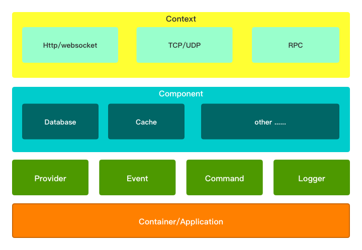

# This is a web framework that firmly believes in dreams.

```
Firmeve = Firm + Believe
``` 

Be firm in your will and believe in your ideals.(坚定自己的意志，相信自己的理想。)

Those who have achieved nothing can always tell you that you can't make a big deal. If you have an ideal, you have to defend it.(那些一事无成的人总是告诉你，你也成不了大器，如果你有理想的话，就要去捍卫它。)

[](https://travis-ci.com/firmeve/firmeve)
[](https://codecov.io/gh/firmeve/firmeve)
[](https://github.com/firmeve/firmeve/blob/master/LICENSE)
[](https://goreportcard.com/report/github.com/firmeve/firmeve)


## Quick start

```bash
go get -u github.com/firmeve/firmeve@develop
```

## 


## Docs

[https://docs.firmeve.com/v/develop/](https://docs.firmeve.com/v/develop/)


## Example
```go
package main

import (
	"github.com/firmeve/firmeve"
	"github.com/firmeve/firmeve/http"
	"github.com/firmeve/firmeve/kernel"
	"github.com/firmeve/firmeve/kernel/contract"
	"github.com/firmeve/firmeve/render"
)

type App struct {
	kernel.BaseProvider
}

func (a *App) Name() string {
	return `app`
}

func (a *App) Register() {
}

func (a *App) Boot() {
	router := a.Firmeve.Get(`http.router`).(contract.HttpRouter)
	v1 := router.Group("/api/v1")
	{
		v1.GET(`/ping`, func(c contract.Context) {
			c.RenderWith(200, render.JSON, map[string]string{
				"message": "pong",
			})
			c.Next()
		})
	}
}

func main() {
	firmeve.RunDefault(firmeve.WithProviders(
		[]contract.Provider{
			new(App),
		},
	))
}

```

Bootstrap command

```bash
go run main.go http:serve
```


## Feature list
- **Core**
    - [x] [Kernel](./docs/zh-CN/kernel.md)
    - [x] [Container](./docs/zh-CN/container.md)
    - [x] [Application](./docs/zh-CN/app.md)
    - [x] [Config](./docs/zh-CN/config.md)
    - [x] [Provider](./docs/zh-CN/provider.md)
    - [x] [Event](./docs/zh-CN/event.md)
    - [x] [Logger](./docs/zh-CN/logger.md)
    - [x] [Command](./docs/zh-CN/command.md)
- **Base**
    - [x] [Http](./docs/zh-CN/http.md)
    - [x] [Database](./docs/zh-CN/databases.md)
    - [x] [Cache](./docs/zh-CN/cache.md)
    - [ ] [Queue](./docs/zh-CN/queue.md)
    - [ ] [Cron](./docs/zh-CN/cron.md)
- **Extension**
